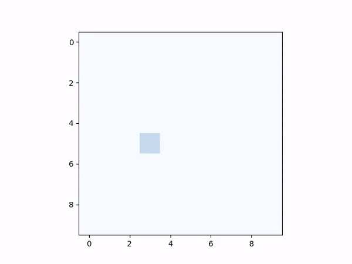
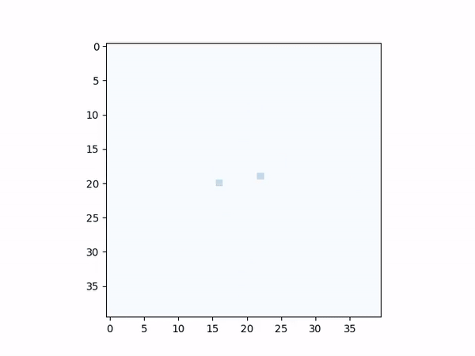
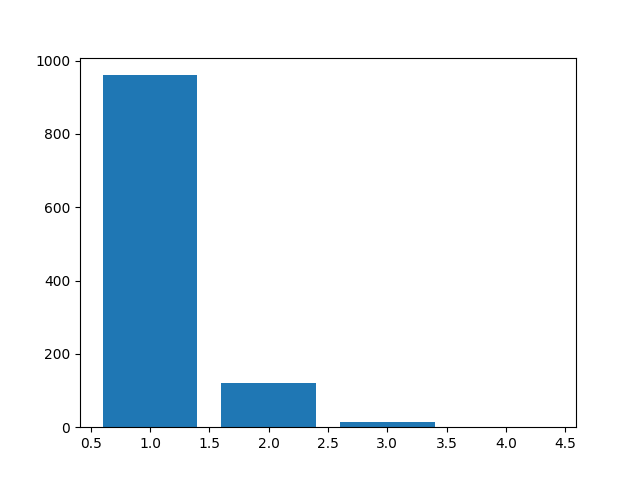
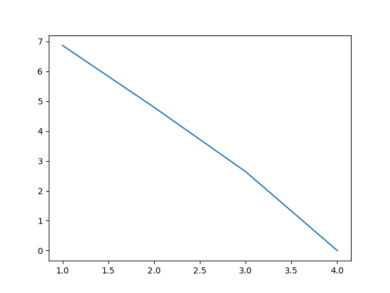

# sandpile

An implementation of the original model of Self-Organized Criticality (SOC).



Do a default run and create a video:

```
python sandpile.py -v
```



Change the size to 40x40, run for 10,000 iterations, and see the totals in a linear distribution with the log line:

```
python sandpile.py -s 40 -i 10_000 -t -l
```





See all options:

```sh
python sandpile.py --help
```
